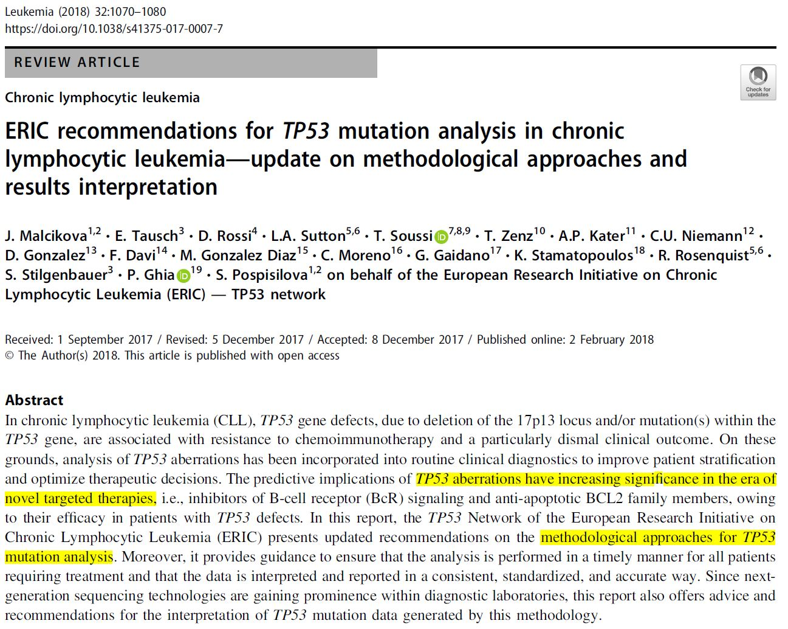

<style>
    body .main-container {
        max-width: 1800px;
    }
</style>

```{r setup, include=FALSE}
knitr::opts_chunk$set(
  cache = F,
	message = FALSE,
	warning = FALSE
	# out.width = "150%"
)
# options(width = 200)
# theme_set(theme_minimal())  + theme(text=element_text(family="Palatino", size=20)))
```

# Librerías

```{r, include=FALSE}
library(readxl) # importar datos

library(dplyr) # manipulación de datos
library(magrittr) # for using %$% 
library(tidyr)
library(tibble)
library(lubridate) # Fechas
library(labelled) # etiqueta de variables
library(splitstackshape) # separar columnas

library(ggplot2) # graficos
library(cowplot) # graficos
library(ggExtra)
theme_set(theme_minimal())

library(summarytools) # descripción de variables a tablas
library(papeR) # resumen de variables
library(Gmisc) # tabla 1

library(knitr)
library(kableExtra)

library(DiagrammeR) # Diagramas

library(pROC) # Roc curves
library(PresenceAbsence) # Roc curves

library(caret) # confusion matrix and c-v

library(randomForest)
library(tuneRanger)
library(OOBCurve) # convergence
```

# El problema general

- Desde el auge tecnológico de secuenciación del genoma humano...

- Clasificar la patogenicidad de las mutaciones

- Causalidad en enfermedades

## Patogenicidad

24 APRIL 2014

<center>
{width=650px} {width=350px}
</center>


<center>
{height=500px} {height=450px}
</center>


## Algoritmos In-silico

<center>
{height=400px} {height=450px}
</center>


# El problema específico

- Patogenicidad en TP53
- Adaptación de las guías de ACMG
- In-silico tools


## A-GVGD + REVEL + BayesDel

<center>
{height=500px}
</center>

### Patogenicidad

<center>
{width=500px}
</center>


## Quantitative model

<center>
{width=750px}
</center>

<center>
{width=750px}
</center>

## ERIC

<center>
{width=750px}
</center>

<center>
{height=450px}
</center>


## Seshat

<center>
{width=750px}
</center>


<center>
{width=750px}
</center>


# Los datos

## UMD TP53

Se utilizan las mutaciones missense {height=450px}


## dbNSFP4.0b1a

Se utilizan 25 predictores:

```{r, include=FALSE}
mutations <- read.delim("../0_get_data/0_RawData/UMD/UMD_mutations_US.tsv", stringsAsFactors=FALSE)

misMut <- filter(mutations, startsWith(Variant_Classification,"Missense") & Variant_Type=="SNP")

data <- readRDS("../0_get_data/1_processed_data/data.rds")

data %>% 
  data.frame() %>% 
  mutate(
    Pathogenicity = ordered(
      Pathogenicity,
      levels=c("Benign",
               "Possibly pathogenic",
               "Likely Pathogenic",
               "Pathogenic",
               "VUS")
      )
  ) %>%
  set_variable_labels(
    SIFT_score="SIFT",
    FATHMM_score="FATHMM",
    PROVEAN_score="PROVEAN",
    VEST4_score="VEST4",
    Polyphen2_HDIV_score="Polyphen2 HDIV",
    Polyphen2_HVAR_score="Polyphen2 HVAR",
    MutationAssessor_score="MutationAssessor",
    LRT_score="LRT",
    fathmm.MKL_coding_score="fathmm MKL coding",
    fathmm.XF_coding_score="fathmm XF coding",
    MutPred_score="MutPred",
    PrimateAI_score="PrimateAI",
    integrated_fitCons_score="integrated fitCons",
    GM12878_fitCons_score="GM12878 fitCons",
    H1.hESC_fitCons_score="H1.hESC fitCons",
    HUVEC_fitCons_score="HUVEC fitCons",
    GERP.._RS="GERP++ RS",
    phyloP100way_vertebrate="phyloP100way vertebrate",
    phyloP30way_mammalian="phyloP30way mammalian",
    phyloP17way_primate="phyloP17way primate",
    phastCons100way_vertebrate="phastCons100way vertebrate",
    phastCons30way_mammalian="phastCons30way mammalian",
    phastCons17way_primate="phastCons17way primate",
    X29way_logOdds="X29way logOdds",
    bStatistic = "bStatistic",
    REVEL_score = "REVEL",
    Pathogenicity = "Pathogenicity"
  ) -> data

```

## Covariables

```{r echo=F}
data %>% 
  select(SIFT_score:bStatistic) %>% 
  names()
```


# Cruce de datos

- UMD TP53 contiene `r nrow(mutations)` mutaciones, de las cuales `r nrow(misMut)` son mutaciones missense.

- Las mutaciones usan la nomenclatura **NM_000546.5** (GRCH37, hg19). Utilizando , se transformaron la coordenadas a **NC_000017.11** (GRCH38, hg38)

- Se tomaron las variaciones únicas y se cruzaron con la base de datos [dbNSFP4.0b1a](https://sites.google.com/site/jpopgen/dbNSFP), a diciembre 8 del 2018, para conseguir los 25 predictores (26 variables con REVEL). 

- Se obtuvieron `r nrow(data)` variantes únicas luego de este cruce. 

- Se perdieron 2 variaciones que no eran verdaderas mutaciones missense. La variable respuesta *patogenicidad* se obtiene de la base de datos UMD.


# Análisis descriptivo

## Resumen de patogenicidad

- Mutaciones missense de UMD (`r nrow(misMut)`).

```{r echo=FALSE}
misMut %>% 
  mutate(
    Pathogenicity = ordered(
      Pathogenicity,
      levels=c("Benign",
               "Possibly pathogenic",
               "Likely Pathogenic",
               "Pathogenic",
               "VUS")
      )
  ) %>% 
  pull(Pathogenicity) %>% 
  describeFactors() %>% 
  data.frame() %>% 
  rownames_to_column() %>% 
  remove_rownames() %>% 
  kable(col.names = c("Patogenicidad", "Frecuencia"), format = "html")  
```
  

- Variantes únicas luego del cruce con dbnsfp (`r nrow(data)`).

```{r echo=FALSE}
data %>% 
  pull(Pathogenicity) %>% 
  describeFactors() %>% 
  data.frame() %>% 
  rownames_to_column() %>% 
  remove_rownames() %>% 
  kable(col.names = c("Patogenicidad", "Frecuencia"), format = "html")
```


## Tabla 1

Variable sccontinuas son resumidas por mediana y rango completo

```{r include=FALSE}
getTable1Stats_patogeni <- function(x, digits = 2, ...){
  
  getDescriptionStatsBy(
    x = x, 
    by = data$Pathogenicity,
    digits = digits,
    useNA = "al",
    continuous_fn = describeMedian,
    ...= list(iqr = F),
    header_count = TRUE,
    hrzl_prop = T,
    show_all_values=TRUE,
    statistics = F,
    add_total_col="last"
    )
  
}
```

```{r include=FALSE}
data %>% 
  select(SIFT_score:REVEL_score)%>% 
  names() -> covariables
```

```{r echo=FALSE}
lapply(covariables,

       function(var) {
           getTable1Stats_patogeni(data[,var])
       }
       ) -> t1

mergeDesc(t1,
          htmlTable_args = list(
            # css.rgroup = "font-size: 0.5em;font-weight: bold;",
            caption  = ""
            # css.cell = "font-size: 0.5em;"
          )
)
```


## Casos completos

- Las variantes VUS no se utilizarán para modelar
- De las `r data %>% filter(Pathogenicity != "VUS") %>% nrow()` variantes restantes cuantas son casos completos (tienen todos los predictores):


```{r echo=FALSE}
data %>% 
  filter(Pathogenicity != "VUS") %>% 
  mutate(
    complete = complete.cases(select(.,SIFT_score:bStatistic)),
    Complete = if_else(complete, "Complete", "Incomplete"),
    Pathogenicity = droplevels(Pathogenicity)
    ) -> data_complete

Hmisc::label(data_complete$Pathogenicity) <- "Pathogenicity"

getDescriptionStatsBy(
  x=data_complete$Pathogenicity, 
  by=data_complete$Complete,
  hrzl_prop = T,
  header_count = TRUE
  ) %>% 
  mergeDesc()
```


## Datos faltantes por columna


```{r echo=FALSE}
data %>% 
  filter(Pathogenicity != "VUS") %>% 
  select(SIFT_score:bStatistic) %>% 
  apply(2, function(x) sum(is.na(x))) -> missings_per_col

data.frame(
  missings_per_col
) %>% 
  rownames_to_column() %>% 
  mutate(
    percen = 100*missings_per_col / nrow(data %>% filter(Pathogenicity != "VUS"))
  ) %>% 
  arrange(-missings_per_col) %>% 
  filter(missings_per_col>0) %>% 
  kable(
    col.names = c("Variable", "Faltantes", "%"),
    digits=2,
    format = "html"
    )

```


## Bloque de datos faltantes

```{r echo=FALSE, rows.print=16}
data %>% 
  filter(
    Pathogenicity == "Benign"
    ) %>% 
  arrange(cDNA_variant)

data %>% 
  filter(
    Pathogenicity == "Benign"
    ) %>% 
  arrange(cDNA_variant) %>% 
  openxlsx::write.xlsx("benign_missings.xlsx")
```


## Predictores

Clases inseparables

```{r supp fig s1 echo=FALSE}
# , fig.height=25, fig.width=18.75
data %>% 
  select(cDNA_variant, SIFT_score:bStatistic,Pathogenicity) %>% 
  gather(variable, score, SIFT_score:bStatistic) %>% 
  ggplot(aes(Pathogenicity, score, fill=Pathogenicity))+
  facet_wrap(. ~ variable, scales = "free", ncol = 5)+
  geom_boxplot()+
  scale_fill_manual(values=c("green", "yellow", "orange", "red", "gray"))+
  theme(
    axis.text.x = element_blank(),
    axis.ticks.x = element_blank(),
    strip.text = element_text(size = 15),
    plot.title = element_text(size = 20, face = "bold"),
    axis.title=element_text(size=14,face="bold")
  )+
  xlab("")+
  ylab("Score Value")+
  ggtitle("Predictors vs Pathogenicity with raw data") 

ggsave(
  "figures/supplementary_figures/Supp. Figure S1.pdf",
  dpi = 600,
  height = 9,
  width = 18.75
  # units = "inches"
  )

```


## REVEL

```{r echo=FALSE, fig.width=11, fig.height=5}
data %>% 
  ggplot(aes(Pathogenicity, REVEL_score,fill=Pathogenicity))+
  geom_boxplot()+
  scale_fill_manual(values=c("green", "yellow", "orange", "red", "gray"))+
  # scale_x_discrete(
  #   labels = c(
  #     "Benignas",
  #     "Posiblemente Patogénicas",
  #     "Probablemente Patogénicas",
  #     "Patogénicas",
  #     "VUS"
  #   )
  # )+
  scale_y_continuous(breaks = seq(0,1,.1))+
  geom_hline(yintercept = 0.5, colour="red") +
  theme(
    axis.text.x = element_text(size = 20,angle = 45, hjust = 1),
    axis.text.y = element_text(size = 20),
    legend.position = "none",
    plot.title = element_text(size = 20, face = "bold"),
    axis.title=element_text(size=24,face="bold")
    )+
  ggtitle("")+
  ylab("REVEL")+
  xlab("Pathogenicity")+

ggsave(
  "figures/thesis_figures/figure1.jpg",
  dpi = 600,
  height = 9,
  width = 18.75,
  # units = "inches"
  )
```


```{r echo=FALSE}
data %>%
  mutate(REVEL = cut(REVEL_score, c(0,.5,1))) %>% 
  select(Pathogenicity,REVEL) %$% 
  getDescriptionStatsBy(
  x= Pathogenicity, 
  by=REVEL,
  hrzl_prop = T,
  header_count = TRUE
  ) %>% 
  mergeDesc()
```


# Nuevo modelo con los 4 niveles

## Data para modelar

```{r include=FALSE}
data %>% 
  filter(Pathogenicity=="VUS") %>% 
  select(SIFT_score:bStatistic) -> vus_variants

data %>% 
  filter(Pathogenicity!="VUS") -> non_vus_variants

non_vus_variants %>% 
  mutate(
    Pathogenicity = droplevels(Pathogenicity),
    Pathogenicity = ordered(
      Pathogenicity,
      levels=c("Benign",
               "Possibly pathogenic",
               "Likely Pathogenic",
               "Pathogenic")
      )
  ) %>% 
  select(SIFT_score:bStatistic, Pathogenicity) -> data_model
```

## Imputación

```{r}
set.seed(17)

data_model_imputed <- rfImpute(
  data = data_model,
  Pathogenicity ~ .,
  iter = 20,
  ntree = 10001
)
```

## Datos imputados

```{r supp fig s3 echo=FALSE}
# , fig.height=25, fig.width=18.75
data_model_imputed %>% 
  gather(variable, score, SIFT_score:bStatistic) %>% 
  ggplot(aes(Pathogenicity, score, fill=Pathogenicity))+
  facet_wrap(. ~ variable, scales = "free", ncol = 5)+
  geom_boxplot()+
  scale_fill_manual(values=c("green", "yellow", "orange", "red", "gray"))+
  theme(
    axis.text.x = element_blank(),
    axis.ticks.x = element_blank(),
    strip.text = element_text(size = 15),
    plot.title = element_text(size = 20, face = "bold"),
    axis.title=element_text(size=14,face="bold")
  )+
  xlab("")+
  ylab("Score Value")+
  ggtitle("Predictors vs Pathogenicity with imputed data") 

ggsave(
  "figures/supplementary_figures/Supp. Figure S3.pdf",
  dpi = 600,
  height = 9,
  width = 18.75,
  # units = "inches"
  )

```


## Parámetros para Random Forest (RF)

### Estimar tiempo de tuning

```{r}
rf_task <- makeClassifTask(
  data = data_model_imputed, 
  target = "Pathogenicity"
  )
rf_task
estimateTimeTuneRanger(rf_task, num.trees = 10001)
```

```{r}
listMeasures(rf_task)
```

```{r}
set.seed(17)
res <- tuneRanger(
  rf_task, 
  num.trees = 10001,
  iters = 70, 
  iters.warmup = 30,
  measure = list(bac),
  # tune.parameters = c(
  #   "mtry",
  #   "min.node.size",
  #   "sample.fraction"
  #   ),
  parameters = list(
    importance = "permutation", 
    splitrule = "gini",
    replace = F
    # probability = T,
    ),
  show.info = F
  )
```

```{r}
res
res$model$learner.model
```

## Ajuste con Ranger (keep inbag) con los parámetros encontrados

```{r}
set.seed(17)

# Con probabilidad

model <- ranger(
  data = data_model_imputed,
  Pathogenicity ~ .,
  num.trees = 10001,
  mtry = res$recommended.pars$mtry,
  min.node.size = res$recommended.pars$min.node.size,
  replace=F,
  sample.fraction = res$recommended.pars$sample.fraction,
  importance = res$model$learner.model$importance.mode,
  splitrule = res$model$learner.model$splitrule,
  keep.inbag = TRUE,
  probability = T
  )


```

```{r}
model
```


## Convergencia con ntree

```{r}
set.seed(17)

# Sin probabilidad

model2 <- ranger(
  data = data_model_imputed,
  Pathogenicity ~ .,
  num.trees = 10001,
  mtry = res$recommended.pars$mtry,
  min.node.size = res$recommended.pars$min.node.size,
  # replace=F,
  sample.fraction = res$recommended.pars$sample.fraction,
  importance = res$model$learner.model$importance.mode,
  splitrule = res$model$learner.model$splitrule,
  keep.inbag = TRUE
  # probability = T
  )
```

```{r}
OOBCurve(
  model2, 
  data= data_model_imputed, 
  task = rf_task,
  measures = list(bac)
  ) -> oobcurve
```

```{r}
oobcurve %>%
  add_column(num.trees=1:nrow(.)) %>%
  ggplot(aes(x=num.trees, y=bac))+
  geom_line()+
  ylim(.2,.8)+
  scale_x_continuous(breaks = seq(0,10001,2000))+
  xlab("#Trees")+
  ylab("Balanced accuracy")+
  ggtitle("Target metric convergence")+
  theme(
    # axis.text.x = element_blank(),
    # axis.ticks.x = element_blank(),
    # strip.text = element_text(size = 15),
    plot.title = element_text(size = 24, face = "bold"),
    axis.title=element_text(size=20,face="bold"),
    text = element_text(size=20)
  )

ggsave(
  "figures/article_figures/Figure 1.pdf",
  dpi = 600,
  height = 12,
  width = 18.75,
  # units = "inches"
  )
```


# Importancia de las variables

```{r echo=FALSE, fig.height=5}
ggplot(
  stack(model$variable.importance),
  aes(reorder(ind,values), values,fill=values)) +
  geom_col() + 
  coord_flip()+
  ylab("")+
  xlab("")+
  ggtitle("Permutation Importance")+
  guides(fill=F)+
  scale_fill_gradient(low="gray", high="black")+
  theme(
    # axis.text.x = element_blank(),
    # axis.ticks.x = element_blank(),
    # strip.text = element_text(size = 15),
    plot.title = element_text(size = 24, face = "bold"),
    axis.title=element_text(size=20,face="bold"),
    text = element_text(size=20)
  )

ggsave(
  "figures/article_figures/Figure 2.pdf",
  dpi = 600,
  height = 12,
  width = 18.75,
  # units = "inches"
  )
```

---

# OOB confusion matrix

```{r}
model$predictions %>% head() # OOB
```


```{r echo=FALSE, out.width = '40%'}
oob_prediction <- colnames(model$predictions)[apply(model$predictions,1,which.max)] # model$predictions = oob probabilities
oob_prediction <- ordered(
  oob_prediction, 
  levels = c("Benign", "Possibly pathogenic", "Likely Pathogenic", "Pathogenic")
  )
confusionMatrix(
  oob_prediction, 
  data_model_imputed$Pathogenicity
  ) 

```

Ligera diferencia con `probability = F`

```{r}
t(model2$confusion.matrix) %>%
  confusionMatrix()
```


# Confusion matrix utilizando todo el RF (overfitting)

```{r}
prob_estimate <- predict(model, data = data_model_imputed)$predictions

class_prediction <- colnames(prob_estimate)[apply(prob_estimate,1,which.max)]
class_prediction <- ordered(
  class_prediction, 
  levels = c("Benign", "Possibly pathogenic", "Likely Pathogenic", "Pathogenic")
  )
confusionMatrix(
  class_prediction, 
  data_model_imputed$Pathogenicity
  )
```

# OOB probabilities


```{r echo=FALSE}
model$predictions %>% # No oob
  head() %>% 
  kable(format = "html", digits=4)
```

```{r}
model$predictions %>%
# predict(model, data=data_model_imputed)$predictions %>% 
  data.frame() %>% 
  add_column(pathogenicity = data_model_imputed$Pathogenicity) %>%
  data.frame() -> df

df %>% gather("category","prob", Benign:Pathogenic) %>% 
  data.frame %>% 
  mutate(
    category = ordered(
      category,
      levels = c(
        "Benign", 
        "Possibly.pathogenic", 
        "Likely.Pathogenic", 
        "Pathogenic"),
      labels = c(
        "Benign", 
        "Possibly pathogenic", 
        "Likely Pathogenic", 
        "Pathogenic")
  )
  ) %>% 
  ggplot(aes(x = category, y = prob, fill=pathogenicity)) +
  geom_boxplot() +
  scale_fill_manual(
    values=c(
      "Green",
      "Yellow",
      "Orange",
      "Red"
    )
    )+
  facet_grid(.~ pathogenicity) +
  ggtitle("Observed pathogenicity")+
  xlab("Class membership")+
  ylab("Probability")+
  theme(
    # axis.text.x = element_blank(),
    # axis.ticks.x = element_blank(),
    # strip.text = element_text(size = 15),
    plot.title = element_text(size = 24, face = "bold"),
    axis.title=element_text(size=20,face="bold"),
    text = element_text(size=20),
    axis.text.x = element_text(angle = 90, vjust = .3, hjust = .95),
    legend.position = "none"
  )

ggsave(
  "figures/supplementary_figures/Supp. Figure S4.pdf",
  dpi = 600,
  height = 12,
  width = 18.75,
  # units = "inches"
  )

```

```{r}
df %>% gather("category","prob", Benign:Pathogenic) %>% 
  data.frame %>% 
  mutate(
    category = ordered(
      category,
      levels = c(
        "Benign", 
        "Possibly.pathogenic", 
        "Likely.Pathogenic", 
        "Pathogenic")
  )) %>% 
  ggplot(aes(x = category, y = prob, color = pathogenicity)) +
  geom_point(position = "jitter") +
  theme(axis.text.x = element_text(angle = 90, vjust = .3, hjust=.95))+
  scale_color_manual(values = c(
    "Benign" = "green",
    "Possibly pathogenic" = "yellow",
    "Likely Pathogenic" = "orange",
    "Pathogenic" = "red")
  )+
  xlab("Class membership")
```

# Análisis ROC

## OOB ROC curves by class

```{r}
df1 <- data.frame(
  ID=1:nrow(data_model_imputed),
  observed=if_else(
    data_model_imputed$Pathogenicity == "Benign",
    1,
    0
  ),
  rf_prob = model$predictions[,1]
    )
df2 <- data.frame(
  ID=1:nrow(data_model_imputed),
  observed=if_else(
    data_model_imputed$Pathogenicity == "Possibly pathogenic",
    1,
    0
  ),
  rf_prob = model$predictions[,2]
    )
df3 <- data.frame(
  ID=1:nrow(data_model_imputed),
  observed=if_else(
    data_model_imputed$Pathogenicity == "Likely Pathogenic",
    1,
    0
  ),
  rf_prob = model$predictions[,3]
    )
df4 <- data.frame(
  ID=1:nrow(data_model_imputed),
  observed=if_else(
    data_model_imputed$Pathogenicity == "Pathogenic",
    1,
    0
  ),
  rf_prob = model$predictions[,4]
    )
```

```{r}
roc1 <- roc(
  df1$observed,
  df1$rf_prob
  )
roc2 <- roc(
  df2$observed,
  df2$rf_prob
  )
roc3 <- roc(
  df3$observed,
  df3$rf_prob
  )
roc4 <- roc(
  df4$observed,
  df4$rf_prob
  )
```

```{r}
# coords(
#   roc4, 
#   .90, intput = "sens",
#   ret=c("threshold", "specificity", "sensitivity"),
#   , transpose = FALSE
#   )
thresholds <- data.frame(
  thresholds = roc4$thresholds,
  sensitivities = roc4$sensitivities,
  specificities = roc4$specificities
)

thresholds %>% 
  filter(
    sensitivities >= .9
  ) %>% 
  arrange(
    sensitivities,
    -specificities
    ) %>% 
  top_n(1) -> req_cut_off
```

```{r}
ggroc(
  list(
    roc1,
    roc2,
    roc3,
    roc4
    ),
    size = 1.2
  )+
  theme_minimal() + 
  labs(
    title = "OOB ROC plot",
    # x = "Specificity",
    y = "Sensibility"
    ) +
  geom_segment(
    aes(x = 1, xend = 0, y = 0, yend = 1), 
    color="grey", 
    linetype="dashed"
    ) +
  # geom_vline(
  #   xintercept = req_cut_off$specificities,
  #   color="grey", 
  #   linetype="dotted",
  #   size = 1.5
  #   ) +
  # geom_hline(
  #   yintercept = req_cut_off$sensitivities,
  #   color="grey", 
  #   linetype="dotted",
  #   size = 1.5
  #   ) +
  geom_point(
    aes(
      x = req_cut_off$specificities[1],
      y = req_cut_off$sensitivities[1],
      color="red",
    ),
    size=20,
    shape = 10
    )+
  scale_color_manual(
    name = "AUC",
    labels = c(
       paste("Benign:",round(roc1$auc,3)),
       paste("Possibly pathogenic:",round(roc2$auc,3)),
       paste("Likely Pathogenic:",round(roc3$auc,3)),
       paste("Pathogenic:",round(roc4$auc,3)),
       paste("Threshold:",round(req_cut_off$thresholds,3))
       ),
    values=c("green", "yellow", "orange", "red", "red"),
    guide = guide_legend(
      override.aes = list(shape = c(rep(NA, 4), 10)))
    )+
  theme(
    # axis.text.x = element_blank(),
    # axis.ticks.x = element_blank(),
    # strip.text = element_text(size = 15),
    plot.title = element_text(size = 34, face = "bold"),
    axis.title=element_text(size=20,face="bold"),
    text = element_text(size=20),
    legend.text=element_text(size=32),
    legend.position = c(0.7, 0.2)
  )

ggsave(
  "figures/article_figures/Figure 3.pdf",
  dpi = 600,
  height = 12,
  width = 18.75,
  # units = "inches"
  )
```


## In-sample Training ROC curves by class (overfitting)

```{r}
df1 <- data.frame(
  ID=1:nrow(data_model_imputed),
  observed=if_else(
    data_model_imputed$Pathogenicity == "Benign",
    1,
    0
  ),
  rf_prob = predict(model, data = data_model_imputed)$predictions[,1]
    )
df2 <- data.frame(
  ID=1:nrow(data_model_imputed),
  observed=if_else(
    data_model_imputed$Pathogenicity == "Possibly pathogenic",
    1,
    0
  ),
  rf_prob = predict(model, data = data_model_imputed)$predictions[,2]
    )
df3 <- data.frame(
  ID=1:nrow(data_model_imputed),
  observed=if_else(
    data_model_imputed$Pathogenicity == "Likely Pathogenic",
    1,
    0
  ),
  rf_prob = predict(model, data = data_model_imputed)$predictions[,3]
    )
df4 <- data.frame(
  ID=1:nrow(data_model_imputed),
  observed=if_else(
    data_model_imputed$Pathogenicity == "Pathogenic",
    1,
    0
  ),
  rf_prob = predict(model, data = data_model_imputed)$predictions[,4]
    )
```

```{r}
roc1 <- roc(
  df1$observed,
  df1$rf_prob
  )
roc2 <- roc(
  df2$observed,
  df2$rf_prob
  )
roc3 <- roc(
  df3$observed,
  df3$rf_prob
  )
roc4 <- roc(
  df4$observed,
  df4$rf_prob
  )
```

```{r}
ggroc(
  list(
    roc1,
    roc2,
    roc3,
    roc4
    )
  )+
  theme_minimal() + 
  labs(
    title = "In-sample ROC plot",
    x = "Specificity",
    y = "Sensibility"
    ) +
  geom_segment(
    aes(x = 1, xend = 0, y = 0, yend = 1), 
    color="grey", 
    linetype="dashed"
    ) +
  theme(legend.position = c(0.7, 0.2))+
  scale_color_discrete(
    name = "AUC", 
    labels = c(
       paste("Benign:",round(roc1$auc,4)),
       paste("Possibly pathogenic:",round(roc2$auc,4)),
       paste("Likely Pathogenic:",round(roc3$auc,4)),
       paste("Pathogenic:",round(roc4$auc,4))
       )
     )
```


# Post-hoc tunning `Pathogenic`

## Alta sensibilidad

```{r echo=FALSE}
df_oob <- data.frame(
  ID=1:nrow(data_model_imputed),
  observed=if_else(
    data_model_imputed$Pathogenicity == "Pathogenic",
    1,
    0
  ),
  rf_prob = model$predictions[,4] # oob
    )
```

Para una sensibilidad requerida del 90% el punto de corte sería 0.07

```{r echo=FALSE}
# Return the AUC under the ROC
df_oob %>% 
  auc.roc.plot(
    # opt.methods =c(2:10), 
    opt.methods =c(10), 
    req.sens = 0.90,
    color = TRUE,
    legend.cex = 0.5,
    opt.legend.cex = 0.5
    )
```


## TP53MiPaPred_sens rendimiento en datos OOB

Estimación del error fuera de muestra optimista

```{r}
model$predictions %>% summary()

model$predictions %>%
  data.frame() %>% 
  filter(Pathogenic > 0.07) %>% 
  nrow()

```


```{r echo=FALSE}
# OOB prediction
sens_oob_pred <- colnames(model$predictions)[apply(model$predictions,1,which.max)]

sens_oob_pred <- ifelse(
  sens_oob_pred == "Benign", "Benign", 
  ifelse(
  model$predictions[,4] > 0.07, "Pathogenic", 
  colnames(model$predictions[,-c(1,4)])[apply(model$predictions[,-c(1,4)],1,which.max)]
  )
)

sens_oob_pred <- ordered(
      sens_oob_pred,
      levels=c("Benign",
               "Possibly pathogenic",
               "Likely Pathogenic",
               "Pathogenic")
      )

colnames(model$predictions)[apply(model$predictions,1,which.max)] %>% 
  ordered(
      levels=c("Benign",
               "Possibly pathogenic",
               "Likely Pathogenic",
               "Pathogenic")
      ) %>% 
  describeFactors() %>% 
  data.frame() %>% 
  rownames_to_column() %>% 
  remove_rownames() %>% 
  kable(col.names = c("Predicción", "Frecuencia"), format = "html")

sens_oob_pred %>% 
  describeFactors() %>% 
  data.frame() %>% 
  rownames_to_column() %>% 
  remove_rownames() %>% 
  kable(col.names = c("Predicción", "Frecuencia"), format = "html")

```

```{r echo=FALSE, out.width = '40%'}
confusionMatrix(
  sens_oob_pred, 
  data_model_imputed$Pathogenicity
  )
```


## Alto VPP

### in_sample (overfitting)

```{r echo=F}
r <- roc(
  response = df_oob$observed, 
  predictor = predict(model, data = data_model_imputed)$predictions[,4])
coordinates <- coords(r, x = "all", input = "threshold", ret = c("threshold", "ppv","sensitivity"))
```

```{r}
coordinates %>% 
  t() %>% 
  data.frame() %>% 
  ggplot(aes(x=threshold, y = value, color = variable)) + 
  geom_point(aes(y = ppv, col = "ppv")) +
  geom_point(aes(y = sensitivity, col = "sensitivity"))+
  scale_x_continuous(breaks = seq(0,1,.1))+
  scale_y_continuous(breaks = seq(0,1,.1))
```

### OOB

```{r echo=F}
r <- roc(response = df_oob$observed, predictor = df_oob$rf_prob)
coordinates <- coords(r, x = "all", input = "threshold", ret = c("threshold", "ppv","sensitivity"))
```

```{r echo=F}
t(coordinates) %>% 
  data.frame() %>% 
  filter(ppv<1) %>% 
  top_n(1,ppv) -> max_ppv

max_ppv %>% 
  kable(format = "html")
```

```{r}
coordinates %>% 
  t() %>% 
  data.frame() %>% 
  ggplot(aes(x=threshold, y = value, color = variable)) + 
    geom_point(aes(y = ppv, col = "ppv")) +
    geom_point(aes(y = sensitivity, col = "sensitivity"))+
    geom_point(
      aes(
        x = max_ppv$threshold,
        y = max_ppv$ppv, 
        col = "red"
        ),
      shape = 10,
      size=20
      )+
    scale_x_continuous(breaks = seq(0,1,.1))+
    scale_y_continuous(breaks = seq(0,1,.1))+
    ggtitle("PPV and sensitivity vs OOB probability of membership to pathogenic class")+
  scale_color_manual(
    name = "",
    labels = c(
      paste0("Cut-off: ", round(max_ppv$threshold,2)),
      paste0("PPV: ", round(max_ppv$ppv,2)),
      paste0("Sensitivity: ", round(max_ppv$sensitivity,2))
    ),
    values=c("indianred", "indianred", "steelblue"),
    guide = guide_legend(
      override.aes = list(
        shape = c(10,20,20)
        # size = 5
        )
      )
    )+
  theme(
    plot.title = element_text(size = 34, face = "bold"),
    axis.title=element_text(size=20,face="bold"),
    text = element_text(size=20),
    legend.text=element_text(size=28)
    # legend.position = c(0.7, 0.2)
  )

ggsave(
  "figures/article_figures/Figure 4.pdf",
  dpi = 600,
  height = 12,
  width = 18.75,
  # units = "inches"
  )
```


## TP53MiPaPred_ppv rendimiento en datos OOB


```{r echo=FALSE}
ppv_oob_pred <- colnames(model$predictions)[apply(model$predictions,1,which.max)]

ppv_oob_pred <- ifelse(
  sens_oob_pred == "Benign", "Benign", 
  ifelse(
  model$predictions[,4] > max_ppv$threshold, "Pathogenic", 
  colnames(model$predictions[,-c(1,4)])[apply(model$predictions[,-c(1,4)],1,which.max)]
  )
)


ppv_oob_pred <- ordered(
      ppv_oob_pred,
      levels=c("Benign",
               "Possibly pathogenic",
               "Likely Pathogenic",
               "Pathogenic")
      )

ppv_oob_pred %>% 
  describeFactors() %>% 
  data.frame() %>% 
  rownames_to_column() %>% 
  remove_rownames() %>% 
  kable(col.names = c("Predicción", "Frecuencia"), format = "html")

```


```{r echo=FALSE, out.width = '40%'}
confusionMatrix(ppv_oob_pred, data_model_imputed$Pathogenicity)
```

# Función para predecir en nuevos datos

La idea es crear una sola función que devuelva las probabilidades estimadas de pertenencia de grupo y la predicción de la clase patogénica del RF normal (la  clase con mayor probabilidad), TP53MiPaPred_sens y TP53MiPaPred_ppv. Esta función se aplica en nuevos conjuntos de datos (ej. VUS). El resultado de esta función es un `data.frame`. De los datos nuevos `newdata` se predice solo sobre los casos completos para los 25 predictores.

```{r}
TP53MiPaPred <- function(newdata){
  
  # Probabilidades
  prediction <- predict(model, data = na.omit(newdata))$predictions
  
  # Clase predicha con el RF normal
  prediction %>% 
    as.tibble() %>%
    mutate(
      default_rf = colnames(.)[apply(.,1,which.max)],
      default_rf = ordered(default_rf,
      levels=c("Benign",
               "Possibly pathogenic",
               "Likely Pathogenic",
               "Pathogenic")
      )
    ) -> prediction
  
  # Clase predicha con TP53MiPaPred_sens
  prediction$sens_model <- ifelse(
    prediction$default_rf == "Benign", "Benign",
      ifelse(
        prediction[,4] > 0.07, "Pathogenic",
        colnames(prediction[,2:3])[apply(prediction[,2:3],1,which.max)]
  )
)

  prediction$sens_model <- ordered(
      prediction$sens_model,
      levels=c("Benign",
               "Possibly pathogenic",
               "Likely Pathogenic",
               "Pathogenic")
      )
  
  # Clase predicha con TP53MiPaPred_ppv
  prediction$ppv_model <- ifelse(
    prediction$default_rf == "Benign", "Benign",
      ifelse(
        prediction[,4] > max_ppv$threshold, "Pathogenic",
        colnames(prediction[,2:3])[apply(prediction[,2:3],1,which.max)]
  )
)

  prediction$ppv_model <- ordered(
      prediction$ppv_model,
      levels=c("Benign",
               "Possibly pathogenic",
               "Likely Pathogenic",
               "Pathogenic")
      )
  
  return(prediction)
}
```


# Variantes VUS

## Datos faltantes

De las `r vus_variants %>% nrow()` variantes VUS `r vus_variants %>% complete.cases() %>% sum()` (`r vus_variants %>% complete.cases() %>% (function(x) sum(x)/length(x)) %>% round(2)*100`%) son casos completos (sin datos faltantes)

```{r echo=F}
vus_variants %>% 
  apply(2, function(x) sum(is.na(x))) -> missings_per_col

data.frame(
  missings_per_col
) %>% 
  rownames_to_column() %>% 
  mutate(
    percen = 100*missings_per_col / nrow(vus_variants)
  ) %>% 
  arrange(-missings_per_col) %>% 
  filter(missings_per_col>0) %>% 
  kable(
    col.names = c("Variable", "Faltantes", "%"),
    digits=2,
    format = "html"
    )

```

---

# Aplicación de los modelos a las VUS

```{r}
vus_pred <- TP53MiPaPred(na.omit(vus_variants))
summary(vus_pred)
```


## Probabilidades de pertenencia de grupo

```{r echo=FALSE}
vus_pred %>% 
  select(Benign:Pathogenic) %>% 
  stack() %>% 
  ggplot(aes(x = ind, y = values)) +
  geom_boxplot()
```

## RF normal

```{r}
vus_pred %>%
  pull(default_rf) %>% 
  describeFactors() %>% 
  data.frame() %>% 
  rownames_to_column() %>% 
  remove_rownames() %>% 
  kable(col.names = c("Predicción", "Frecuencia"), format = "html") %>% 
  kable_styling()
```

## TP53MiPaPred_sens

```{r }

vus_pred %>%
  pull(sens_model) %>% 
  describeFactors() %>% 
  data.frame() %>% 
  rownames_to_column() %>% 
  remove_rownames() %>% 
  kable(col.names = c("Predicción", "Frecuencia"), format = "html") %>% 
  kable_styling()

```


  
```{r}
vus_pred %>% 
  select(Benign:Pathogenic,sens_model) %>% 
  gather("category","prob", Benign:Pathogenic) %>% 
  ggplot(aes(x = category, y = prob)) +
  geom_boxplot() +
  facet_grid(.~ sens_model) +
  theme(axis.text.x = element_text(angle = 90, vjust = .5))+
  xlab("Membership probability")
```
  
  
## TP53MiPaPred_ppv

```{r }

vus_pred %>%
  pull(ppv_model) %>% 
  describeFactors() %>% 
  data.frame() %>% 
  rownames_to_column() %>% 
  remove_rownames() %>% 
  kable(col.names = c("Predicción", "Frecuencia"), format = "html") %>% 
  kable_styling()

```


  
```{r}
vus_pred %>% 
  select(Benign:Pathogenic,ppv_model) %>% 
  gather("category","prob", Benign:Pathogenic) %>% 
  ggplot(aes(x = category, y = prob)) +
  geom_boxplot() +
  facet_grid(.~ ppv_model) +
  theme(axis.text.x = element_text(angle = 90, vjust = .5))+
  xlab("Membership probability")
```

# Exportación de datos imputados, Modelo Ranger, Función de predicción y VUS con predicciones

## Datos imputados

```{r}
data %>% 
  filter(Pathogenicity!="VUS") %>% 
  select(cDNA_variant:Mutant_AA_3) %>% 
  cbind(data_model_imputed) %>% 
  openxlsx::write.xlsx("data_model_imputed.xlsx")
```

## Modelo ranger y función de predicción

Para predecir sobre nuevos datos está disopnible el modelo implementado con el paquete ranger y la función de predicción expuesta arriba.

`model$predictions` contiene las predicciontes OOB sobre los datos imputados.

```{r}
save(list = c("TP53MiPaPred","model"), file = "load_to_predict.RData")

# require(ranger)
# load("load_to_predict.RData")
```

## VUS con predicciones

Sobre las variantes VUS con predictores completos

```{r}
data %>% 
  filter(Pathogenicity=="VUS") %>% 
  select(cDNA_variant:bStatistic) %>% 
  na.omit() -> vus_variants_na_omit

data.frame(
  vus_variants_na_omit,
  TP53MiPaPred(vus_variants_na_omit)
) %>% 
  openxlsx::write.xlsx("vus_predictions.xlsx")
```

